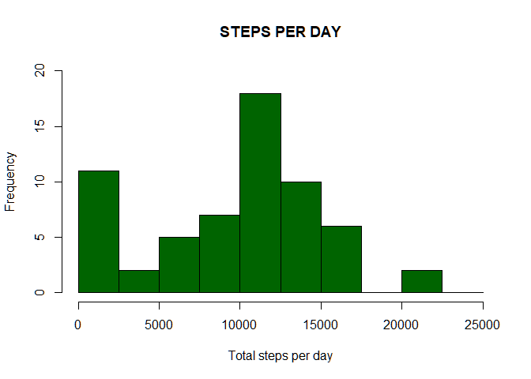
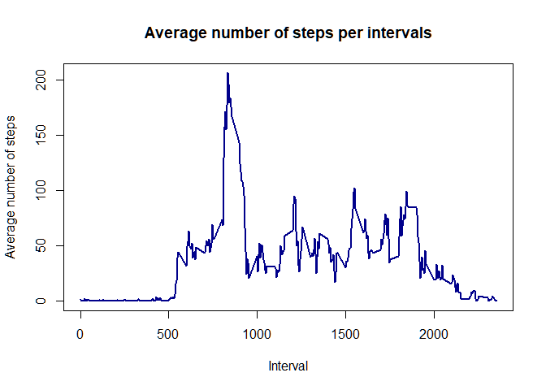
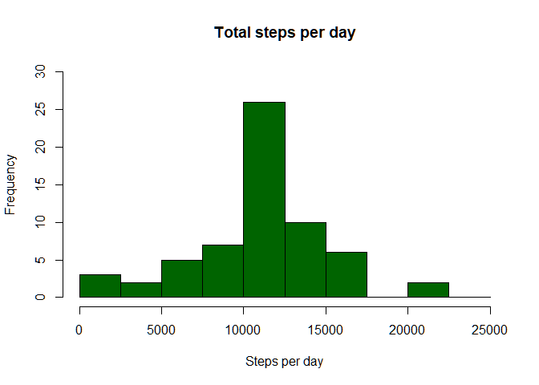
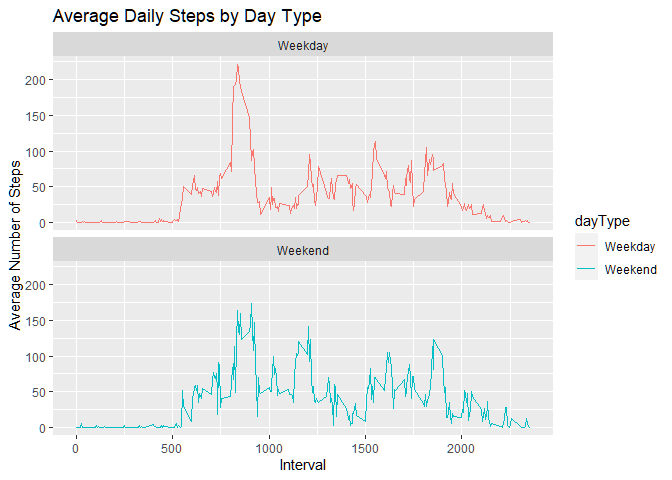

## Assignment and Preprocessing
This assignment will be described in multiple parts. You will need to write a report that answers the questions detailed below. Ultimately, you will need to complete the entire assignment in a single R markdown document that can be processed by knitr and be transformed into an HTML file.

Throughout your report make sure you always include the code that you used to generate the output you present. When writing code chunks in the R markdown document, always use echo = TRUE so that someone else will be able to read the code. This assignment will be evaluated via peer assessment so it is essential that your peer evaluators be able to review the code for your analysis.

For the plotting aspects of this assignment, feel free to use any plotting system in R (i.e., base, lattice, ggplot2)

Fork/clone the GitHub repository created for this assignment. You will submit this assignment by pushing your completed files into your forked repository on GitHub. The assignment submission will consist of the URL to your GitHub repository and the SHA-1 commit ID for your repository state.

Questions to be answered:

- What is mean total number of steps taken per day?
- What is the average daily activity pattern?
- Imputing missing values
- Are there differences in activity patterns between weekdays and weekends?


## Set Up Environment

```r
library(ggplot2)
library(readr)

activity <- read_csv("./data/activity.csv", show_col_types = FALSE)
```


## Loading and processing the data
### 

```r
activity$date <- as.POSIXct(activity$date)
weekday <- weekdays(activity$date)
activity <- cbind(activity, weekday)

summary(activity)
```

```
##      steps             date                        interval     
##  Min.   :  0.00   Min.   :2012-09-30 19:00:00   Min.   :   0.0  
##  1st Qu.:  0.00   1st Qu.:2012-10-15 19:00:00   1st Qu.: 588.8  
##  Median :  0.00   Median :2012-10-30 19:00:00   Median :1177.5  
##  Mean   : 37.38   Mean   :2012-10-30 19:00:00   Mean   :1177.5  
##  3rd Qu.: 12.00   3rd Qu.:2012-11-14 19:00:00   3rd Qu.:1766.2  
##  Max.   :806.00   Max.   :2012-11-29 19:00:00   Max.   :2355.0  
##  NA's   :2304                                                   
##    weekday         
##  Length:17568      
##  Class :character  
##  Mode  :character  
##                    
##                    
##                    
## 
```
## Question #1
### What is mean total number of steps taken per day?
#### 1.1. Make Make a histogram of the total number of steps taken each day

```r
total_steps <- with(activity, aggregate(steps, by = list(date), FUN = sum, na.rm = TRUE))
names(total_steps) <- c("date", "steps")
hist(total_steps$steps, main = "STEPS PER DAY", xlab = "Total steps per day", col = "darkgreen", ylim = c(0,20), breaks = seq(0,25000, by=2500))
```

<!-- -->

### 1.2. Calculate and report the mean and median total number of steps taken per day

```r
cat(paste("Daily mean of steps:", sprintf(mean(total_steps$steps), fmt = '%.0f')))
```

```
## Daily mean of steps: 9354
```

```r
cat(paste("\nDaily median of steps:", sprintf(median(total_steps$steps), fmt = '%.0f' )))
```

```
## 
## Daily median of steps: 10395
```

## Question #2
### What is the average daily pattern?
#### 2.1. Make a time series plot (i.e. type = "l") of the 5-minute interval (x-axis) and the average number of steps taken, averaged across all days (y-axis)

```r
average_daily_activity <- aggregate(activity$steps, by=list(activity$interval), FUN=mean, na.rm=TRUE)
names(average_daily_activity) <- c("interval", "mean")
plot(average_daily_activity$interval, average_daily_activity$mean, type = "l", col="darkblue", lwd = 2, xlab="Interval", ylab="Average number of steps", main="Average number of steps per intervals")
```

<!-- -->

#### 2.2. Which 5-minute interval, on average across all the days in the dataset, contains the maximum number of steps?

```r
max_steps <- average_daily_activity[which.max(average_daily_activity$mean), ]$interval
cat(paste("The maximum number of steps in a day is",max_steps))
```

```
## The maximum number of steps in a day is 835
```

## Question #3
### Filling missing values
#### 3.1. Calculate and report the total number of missing values in the dataset (i.e. the total number of rows with NAs)

```r
sum(is.na(activity$steps))
```

```
## [1] 2304
```

#### 3.2. Devise a strategy for filling in all of the missing values in the dataset. The strategy does not need to be sophisticated. For example, you could use the mean/median for that day, or the mean for that 5-minute interval, etc.

```r
filled_steps <- average_daily_activity$mean[match(activity$interval, average_daily_activity$interval)]
```

#### 3.3. Create a new dataset that is equal to the original dataset but with the missing data filled in.

```r
activity_filled <- transform(activity, steps = ifelse(is.na(activity$steps), yes = filled_steps, no = activity$steps))
total_steps_filled <- aggregate(steps ~ date, activity_filled, sum)
names(total_steps_filled) <- c("date", "daily_steps")
head(activity_filled, 2)
```

```
##       steps                date interval weekday
## 1 1.7169811 2012-09-30 19:00:00        0  Sunday
## 2 0.3396226 2012-09-30 19:00:00        5  Sunday
```

#### 3.4. Make a histogram of the total number of steps taken each day and Calculate and report the mean and median total number of steps taken per day. 

```r
hist(total_steps_filled$daily_steps, col = "darkgreen", xlab = "Steps per day", ylim = c(0,30), 
     main = "Total steps per day", breaks = seq(0,25000,by=2500))
```

<!-- -->


```r
cat(paste("Daily Mean of steps:", sprintf(mean(total_steps_filled$daily_steps), fmt = '%.0f')))
```

```
## Daily Mean of steps: 10766
```

```r
cat(paste("\nDaily Median of steps:", sprintf(median(total_steps_filled$daily_steps), fmt = '%.0f' )))
```

```
## 
## Daily Median of steps: 10766
```

#### Do these values differ from the estimates from the first part of the assignment? 
_Yes, the values differ_
#### What is the impact of imputing missing data on the estimates of the total daily number of steps?
_It increases de daily mean from 9,354 steps to 10,766 and evens the mean with the median._

## Question #4
### Are there differences in activity patterns between weekdays and weekends?
#### 4.1. Create a new factor variable in the dataset with two levels – “weekday” and “weekend” indicating whether a given date is a weekday or weekend day.

```r
# Separate weekdays from weekends
activity$date <- as.Date(strptime(activity$date, format="%Y-%m-%d"))
activity$dayType <- sapply(activity$date, function(x) {
  if(weekdays(x) == "Saturday" | weekdays(x) == "Sunday")
  {y <- "Weekend"}
  else {y <- "Weekday"}
  y
})
head(activity, 2)
```

```
##   steps       date interval weekday dayType
## 1    NA 2012-09-30        0  Sunday Weekend
## 2    NA 2012-09-30        5  Sunday Weekend
```

#### 4.2. Make a panel plot containing a time series plot (i.e. type = "l") of the 5-minute interval (x-axis) and the average number of steps taken, averaged across all weekday days or weekend days (y-axis).

```r
# Data set to plot
activityByDay <-  aggregate(steps ~ interval + dayType, activity, mean, na.rm = TRUE)
head(activityByDay, 2)
```

```
##   interval dayType     steps
## 1        0 Weekday 2.0769231
## 2        5 Weekday 0.4615385
```

```r
tail(activityByDay, 2)
```

```
##     interval dayType steps
## 575     2350 Weekend     0
## 576     2355 Weekend     0
```

```r
# Plotting using ggplot2
PatternByDay <-  ggplot(activityByDay, aes(x = interval , y = steps, color = dayType)) + 
  geom_line() + ggtitle("Average Daily Steps by Day Type") + 
  xlab("Interval") + 
  ylab("Average Number of Steps") +
  facet_wrap(~dayType, ncol = 1, nrow=2)

print(PatternByDay) 
```

<!-- -->

#### The level of activity in weekdays is greater than in weekends.


